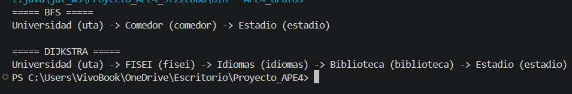

# APE 4 — Grafos: Mapa del Campus UTA

## Estructura de Datos — Universidad Técnica de Ambato

---

# Objetivo

Implementar un grafo utilizando lista de adyacencia para representar rutas dentro del Campus Huachi de la UTA y comparar los algoritmos BFS y Dijkstra.

---

# Descripción del Proyecto

Este proyecto implementa un grafo mediante listas de adyacencia para modelar diferentes ubicaciones del Campus Huachi de la Universidad Técnica de Ambato.

A través de esta representación se comparan dos algoritmos ampliamente utilizados en teoría de grafos:

* BFS (Breadth-First Search)
* Dijkstra

La práctica permite analizar cómo ambos algoritmos generan rutas distintas dependiendo del criterio utilizado.

---

# Actividades realizadas

Se completaron los métodos marcados con `TODO` dentro del archivo:

```bash
APE4_Grafos.java
```

Métodos implementados:

* agregarNodo()
* agregarArista()
* bfs()
* dijkstra()

---

# Instrucciones

1. NO modificar la estructura principal del programa.

2. Completar únicamente las secciones marcadas con `TODO`.

3. Mantener el funcionamiento correcto del programa.

4. Compilar y ejecutar correctamente el archivo.

5. Comparar los resultados obtenidos entre:

   * BFS → ruta con menos paradas.
   * Dijkstra → ruta con menor distancia.

6. Comentar el código implementado.

---

# Importante

El archivo contenía métodos incompletos (`TODO`) que fueron desarrollados respetando la estructura original proporcionada para la práctica.

---

# Ubicaciones Representadas

Los nodos utilizados dentro del grafo son:

* Universidad
* FISEI
* Idiomas
* Biblioteca
* Estadio
* Comedor

---

# Conexiones del Grafo

| Origen      | Destino    | Distancia |
| ----------- | ---------- | --------- |
| Universidad | FISEI      | 50        |
| FISEI       | Idiomas    | 40        |
| Idiomas     | Biblioteca | 30        |
| Biblioteca  | Estadio    | 70        |
| Universidad | Comedor    | 20        |
| Comedor     | Estadio    | 200       |

---

# Evidencias requeridas

Tomar capturas de pantalla de:

* Resultado del algoritmo BFS.
* Resultado del algoritmo Dijkstra.

---

# Capturas de Pantalla

## Ejecución del Programa



---

# Entrega en GitHub

Estructura del proyecto:

```text
Proyecto_APE4/
│
├── src/
│   └── APE4_Grafos.java
│
├── captura/
│   └── ejecucion.png
│
└── README.md
```

---

# Compilación y ejecución

## Compilar

```bash
javac APE4_Grafos.java
```

## Ejecutar

```bash
java APE4_Grafos
```

---

# Conceptos importantes

## BFS (Breadth-First Search)

Busca la ruta con menor número de paradas o nodos intermedios.

Para esta práctica encuentra la ruta:

```text
Universidad → Comedor → Estadio
```

Debido a que requiere menos conexiones entre nodos.

---

## Dijkstra

Busca la ruta con menor distancia total considerando el peso de las aristas.

Para esta práctica encuentra la ruta:

```text
Universidad → FISEI → Idiomas → Biblioteca → Estadio
```

Porque la distancia total es menor que la ruta que pasa por el comedor.

---

## Lista de adyacencia

Representa para cada nodo una lista de vecinos conectados.

Es eficiente para grafos dispersos y permite recorrer fácilmente las conexiones de cada ubicación.

---

# Resultados obtenidos

* Se implementó correctamente un grafo utilizando lista de adyacencia.
* Se desarrollaron los algoritmos BFS y Dijkstra.
* El programa compiló y ejecutó correctamente.
* BFS encontró la ruta con menos paradas.
* Dijkstra encontró la ruta con menor distancia.
* Se comparó el comportamiento de ambos algoritmos sobre el mismo conjunto de nodos.

---

# Resultados esperados

El estudiante desarrollará habilidades para:

* representar problemas reales mediante grafos,
* implementar grafos usando lista de adyacencia,
* comprender el funcionamiento de BFS y Dijkstra,
* calcular rutas entre ubicaciones,
* comparar algoritmos de búsqueda y caminos mínimos.

---

# Autor

**Shirley Amaguaña**

Ingeniería de Software

Universidad Técnica de Ambato
